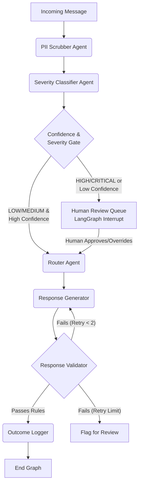

# 🛟 CrisisNet
**Multi-Agent AI Crisis Triage Architecture**

> [!CAUTION]
> **Research Prototype — Not a real crisis service.**
>
> CrisisNet is a capstone/portfolio project demonstrating a multi-agent crisis-triage architecture using LangGraph. It is **not** a deployed service, and is **not validated for real-world crisis use**. 
> 
> * All data processed by this system is entirely synthetic. 
> * Never claim to be a licensed therapist.
> * Never diagnose.
> * AI-generated responses are advisory only and must never replace human judgment for high-risk cases.

---

## 📖 Overview

CrisisNet is a real-time crisis triage platform that processes incoming synthetic text messages, classifies severity, routes cases appropriately, escalates critical cases to humans, and logs outcomes.

It demonstrates a robust, safety-first implementation of **Agentic AI** using LangGraph, ensuring that autonomous agents have hard guardrails, human-in-the-loop (HITL) overrides, and deterministic rule-based validation.

## ✨ Key Features

- **Multi-Agent Pipeline**: PII Scrubbing, Severity Classification, Routing, Response Generation, and Validation.
- **Safety-First Routing**: A "Confidence Gate" overrides the AI and forces a human review if the classification confidence is below 75%.
- **Human-in-the-loop (HITL)**: Uses LangGraph's `interrupt()` pattern to fully pause the graph execution until a human reviewer takes action on HIGH/CRITICAL severity cases.
- **Real-Time Dashboard**: A Next.js frontend with WebSocket integration to show incoming messages, review queues, and live system analytics instantly.
- **Defense in Depth**: LLMs are sandboxed. The system enforces strict JSON schema outputs (Pydantic) and uses non-AI, rule-based validators to check AI-generated responses.

---

## 🏗️ Multi-Agent Architecture



---

## 🛠️ Tech Stack

**Frontend**
* Framework: Next.js 16 (App Router)
* Language: TypeScript
* Styling: TailwindCSS v4, Custom CSS Glassmorphism
* Charts & Icons: Recharts, Lucide React

**Backend**
* Framework: FastAPI (Python)
* Orchestration: LangGraph, LangChain
* Database: PostgreSQL (asyncpg, SQLAlchemy)
* Real-Time: WebSockets
* Authentication: JWT-based Auth (Access & Refresh Tokens)

**AI Models**
* `llama3-70b-8192` (via Groq) for high-speed deterministic routing/classification.
* `gemini-1.5-pro-latest` (via Google GenAI) for empathetic reasoning and response generation.

---

## 🚀 Setup & Installation

### Prerequisites
* Docker and Docker Compose
* API Keys for Groq and Google Gemini

### 1. Environment Setup
Clone the repository and set up the backend environment variables:
```bash
cd backend
cp .env.example .env
```
Edit the `.env` file and insert your API keys:
```env
POSTGRES_USER=postgres
POSTGRES_PASSWORD=postgres
POSTGRES_DB=crisisnet

GROQ_API_KEY=your_groq_api_key_here
GEMINI_API_KEY=your_gemini_api_key_here
```

### 2. Run with Docker Compose
Start the entire stack (Database, Backend, Frontend):
```bash
docker-compose up -d --build
```

### 3. Seed the Database
Populate the database with the default users and synthetic test messages:
```bash
cd backend
python -m app.data.seed
```

### 4. Access the Dashboard
Open your browser and navigate to: **http://localhost:3000**

**Demo Credentials (⚠️ Local development only):**
* **Admin:** `admin@crisisnet.dev` / `admin1234`
* **Reviewer:** `reviewer@crisisnet.dev` / `reviewer1234`
* **Viewer:** `viewer@crisisnet.dev` / `viewer1234`

> [!WARNING]
> These are **hardcoded seed credentials for local development only**. They are stored in `backend/app/data/seed.py`, not in `.env`. If deploying publicly, you must either remove the seed script entirely or change the passwords to random values via environment variables. Never use default credentials in a deployed environment.

---

## 📚 Educational Companion

If you are exploring this codebase to learn about Agentic AI, LangGraph, and FastAPI, check out the **[LEARN.md](./LEARN.md)** file! 

It contains "Explain Like I'm 5" (ELI5) breakdowns of the core concepts used to build this project, including:
1. Agentic Frameworks vs. Standard Scripts
2. Managing "State" (The Graph Memory)
3. Structured Outputs (No more regex parsing!)
4. The Confidence Gate & Validation Loops
5. WebSockets, APIs, and Schemas
